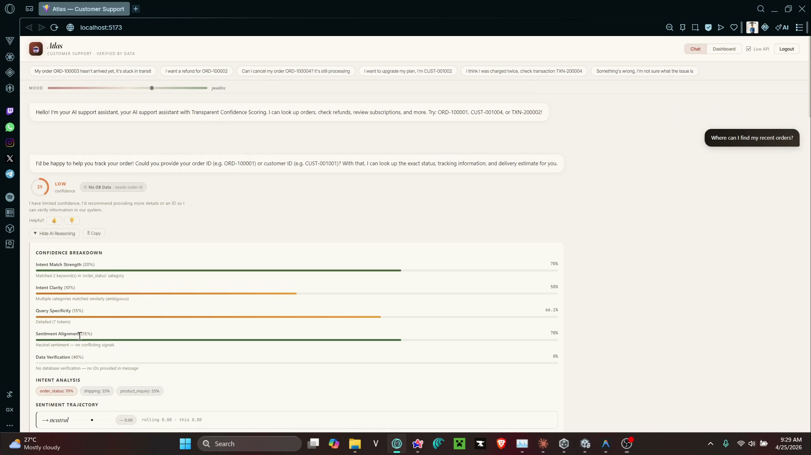

# 🤖 Atlas — Intelligent Customer Support System

### NLP Chatbots · Explainable AI · Transparent Confidence Scoring

> A production-style customer-support chatbot that doesn't just *answer* — it **shows its work**. Every reply is grounded in real database records and accompanied by a transparent, 5-factor confidence breakdown, full intent/sentiment explainability, and an automatic human-handoff signal when it isn't sure.

<p align="left">
  
  
  
  
  
  
  
  
</p>

---

## 🎥 Demo

[](assets/demo.mp4)

▶️ **[Click the image above to watch the full walkthrough](assets/demo.mp4)** — intent detection, live database lookups, the transparent confidence breakdown, and automatic human-handoff in action.

---

## 📑 Table of Contents

- [Demo](#-demo)
- [Overview](#-overview)
- [Motivation](#-motivation--the-problem)
- [Key Features](#-key-features)
- [Architecture](#-architecture)
- [Explainable AI in Detail](#-explainable-ai-in-detail)
- [Tech Stack](#-tech-stack)
- [Repository Structure](#-repository-structure)
- [Installation & Setup](#-installation--setup)
- [Usage](#-usage)
- [API Reference](#-api-reference)
- [Testing](#-testing)
- [Development Methodology](#-development-methodology--subagent-driven-development)
- [Roadmap](#-roadmap)
- [Contributing](#-contributing)
- [Author & Contact](#-author--contact)
- [License](#-license)

---

## 🔭 Overview

Most "AI" support bots are black boxes: a confident-sounding answer with no way to tell whether it's correct, made up, or hallucinated. Atlas takes the opposite stance — **trust through transparency**.

The system runs every incoming message through a deterministic NLP pipeline, looks up the referenced entities (orders, customers, transactions, subscriptions) in a real PostgreSQL database, and generates a **genuine, data-grounded response**. Crucially, it returns *why* it answered the way it did: the detected intent and runners-up, the sentiment analysis, exactly which database records it verified against, and a weighted breakdown of its confidence — then proactively recommends a human agent when confidence is low or the customer is frustrated.

The intelligence is layered with **graceful degradation**, so the system is useful whether you have a GPU and an LLM key or just Python and Postgres:

| Layer | Component | What it adds | Falls back to |
| :-- | :-- | :-- | :-- |
| **Core** | `app.py` (hand-coded NLP) | Lexicon sentiment, keyword intent, regex ID extraction, DB-grounded responses, confidence scoring | *(always on — zero external models)* |
| **ML** | `ml_service.py` (Transformers) | Fine-tuned / zero-shot intent + RoBERTa sentiment | Keyword-based core NLP |
| **LLM** | `llm_service.py` (NVIDIA NIM) | Fluent, natural-language phrasing of the verified answer | Deterministic template text |

---

## 🎯 Motivation — The Problem

Customer-support automation faces a credibility gap:

1. **Hallucination risk** — generative bots invent order numbers, refund amounts, and policies that don't exist.
2. **Opacity** — users (and the businesses deploying the bot) can't tell *why* an answer was given or whether to trust it.
3. **No safety net** — bots barrel ahead at full confidence even when they should be escalating to a human.

Atlas was built to demonstrate an architecture that **directly addresses all three**:

- Responses are **constructed from verified database values** — the LLM layer is handed the records verbatim and explicitly instructed never to invent IDs, amounts, or dates.
- Every response ships with a **machine- and human-readable explanation** of intent, sentiment, data lookups, and a transparent confidence score.
- A **handoff engine** automatically flags conversations for a human when confidence drops or frustration spikes.

---

## ✨ Key Features

- 🧠 **Multi-stage NLP pipeline** — preprocessing → sentiment → intent classification → ID extraction → DB context → response generation → confidence → handoff, all in one explainable flow.
- 🗄️ **Genuine, data-grounded responses** — replies are built from live PostgreSQL records (orders, customers, transactions, subscriptions), not canned templates. Each answer differs per entity.
- 📊 **Transparent confidence scoring** — five weighted factors: Intent Match (20%), Intent Clarity (10%), Query Specificity (15%), Sentiment Alignment (15%), and a signature **Data Verification (40%)** factor — the single highest-weighted signal — that rewards answers backed by verified data.
- 🔍 **Explainable AI by design** — the API returns the full reasoning trail: detected intent + all candidate scores, sentiment label/intensity, every database lookup performed, and per-factor confidence explanations.
- 🆔 **Automatic entity extraction** — regex pulls `ORD-`, `CUST-`, `TXN-`, and `SUB-` IDs out of free text, with conversational context carry-over (a follow-up keeps the previous order/customer in scope).
- 🤝 **Proactive human handoff** — escalates automatically when confidence drops below ~35 or frustration intensity is high.
- 🎭 **Sentiment-aware empathy** — negation- and intensifier-aware lexicon analysis; an empathy prefix is prepended for frustrated customers.
- 🔄 **Continuous-learning loop** — low-rated / flagged interactions are pulled from the feedback table to fine-tune a custom intent classifier (`train_model.py`), which `ml_service.py` then prefers automatically.
- 🔐 **Production-grade API** — JWT auth with role-based access, rate limiting, CORS allow-listing, a thread-safe DB connection pool, and graceful degradation when the database is offline.
- ⚛️ **Interactive React UI** — Vite + React 19 frontend with a *Live API* toggle (mock data ↔ real backend) and DB-verification badges.

---

## 🏗️ Architecture

### Request pipeline (`POST /api/chat`)

```
        ┌──────────────────────────────────────────────────────────────┐
        │                     Incoming user message                     │
        └──────────────────────────────────────────────────────────────┘
                                     │
   preprocess() ─▶ analyze_sentiment() ─▶ classify_intent() ─▶ extract_ids()
                                     │
                          gather_db_context()  ── PostgreSQL ──┐
                                     │            (orders, customers,
                          build_genuine_response()  txns, subs, refunds)
                                     │
              ┌──────────────────────┴──────────────────────┐
              │   LLM enhancement (optional, NVIDIA NIM)     │
              │   rewrites text, grounded on verified data   │
              └──────────────────────┬──────────────────────┘
                                     │
              compute_confidence()  ─▶  evaluate_handoff()
                                     │
        ┌──────────────────────────────────────────────────────────────┐
        │  JSON: response + response_meta + confidence + explainability │
        │        + handoff recommendation                               │
        └──────────────────────────────────────────────────────────────┘
```

### Layered system view

```
┌──────────────────────────────────────────────────────────────────────┐
│  Frontend  ·  React 19 + Vite  (Live-API toggle, verification badges)  │
└───────────────────────────────┬──────────────────────────────────────┘
                                 │  REST / JSON  (CORS allow-list)
┌───────────────────────────────▼──────────────────────────────────────┐
│  API Gateway  ·  Flask + Flask-Limiter + JWT (role-based auth)         │
├───────────────────────────────────────────────────────────────────────┤
│  NLP / XAI Core  ·  app.py                                             │
│    sentiment · intent · ID extraction · response builder · confidence  │
│                                                                        │
│   ┌── optional ──────────────┐     ┌── optional ───────────────────┐   │
│   │ ML Service               │     │ LLM Service                   │   │
│   │ HF Transformers          │     │ NVIDIA NIM · Llama 3.1 405B   │   │
│   │ (intent + sentiment)     │     │ (grounded NL generation)      │   │
│   └──────────────────────────┘     └───────────────────────────────┘   │
├───────────────────────────────────────────────────────────────────────┤
│  Data Layer  ·  db_service.py  ·  ThreadedConnectionPool (2–10)        │
│                @db_operation graceful-degradation decorator            │
├───────────────────────────────────────────────────────────────────────┤
│  PostgreSQL  ·  customers · orders · order_items · transactions ·      │
│                 subscriptions · chat_interactions · feedback           │
│                 (UUID PKs + human IDs · CHECK constraints · triggers)  │
└───────────────────────────────────────────────────────────────────────┘
                                 ▲
                                 │  feedback-driven retraining
                       train_model.py ── fine-tunes ──▶ models/custom-intent/
```

### Component responsibilities

| Component | Responsibility |
| :-- | :-- |
| `app.py` | Flask API + the full hand-coded NLP/XAI pipeline and response generator |
| `db_service.py` | Connection pool, parameterized queries, refund-eligibility logic, graceful-degradation decorator |
| `ml_service.py` | Optional Hugging Face intent (fine-tuned / zero-shot) and RoBERTa sentiment |
| `llm_service.py` | Optional NVIDIA NIM (Llama 3.1 405B) response generation, strictly grounded on verified DB records |
| `train_model.py` | Feedback-driven fine-tuning pipeline for the custom intent classifier |
| `schema.sql` / `sample_data.sql` | PostgreSQL schema (UUID + business IDs, CHECK constraints, `update_timestamp` triggers) and seed data |
| `frontend/` | Vite + React 19 chat UI with Live-API toggle and verification badges |
| `test_app.py` | 35+ unit/integration tests covering NLP functions and API endpoints |

---

## 🔬 Explainable AI in Detail

### The 5-factor confidence formula

```
Final Score = (Intent Match Strength × 20%)
            + (Intent Clarity         × 10%)
            + (Query Specificity      × 15%)
            + (Sentiment Alignment    × 15%)
            + (Data Verification      × 40%)   ◀── the dominant trust signal
```

**Data Verification is the single largest factor (40%)** — and it's the differentiator: when the bot can verify its answer against a real database record, confidence jumps meaningfully, turning "confidence" from a vibe into an auditable signal.

| Query | Confidence | Why |
| :-- | :-- | :-- |
| `I want a refund` | ≈ 35% | No entity to verify against |
| `I want a refund for ORD-100002` | ≈ 80% | Verified against a real order record |

### A real response payload

```json
{
  "response": "Hi Sarah! Order ORD-100001 was delivered...",
  "response_meta": {
    "source": "db_order_delivered",
    "data_verified": true,
    "data_used": ["order:ORD-100001"]
  },
  "confidence": {
    "score": 72.4,
    "level": "high",
    "description": "Highly confident — backed by verified data...",
    "factors": [ /* 5 factors, each with a plain-English explanation */ ],
    "missing_information": []
  },
  "explainability": {
    "intent":    { "detected": "order_status", "all_candidates": [ /* ... */ ] },
    "sentiment": { "label": "neutral", "score": 0 },
    "database":  {
      "ids_extracted":      { "order_id": "ORD-100001" },
      "lookups_performed":  ["Looked up order ORD-100001"],
      "data_found":         true
    }
  },
  "handoff": { "recommended": false }
}
```

---

## 🛠️ Tech Stack

| Category | Technologies |
| :-- | :-- |
| **Backend** | Python 3.13, Flask 3.1, Flask-CORS, Flask-Limiter, Gunicorn |
| **Auth & Security** | PyJWT (HS256), role-based access control, in-memory rate limiting, CORS allow-listing |
| **Database** | PostgreSQL, `psycopg2` (ThreadedConnectionPool), PL/pgSQL triggers & CHECK constraints |
| **NLP (core)** | Hand-coded lexicon sentiment + keyword-coverage intent classification (no external models required) |
| **ML (optional)** | Hugging Face Transformers, PyTorch, Datasets, Evaluate, Accelerate, scikit-learn — DistilBART-MNLI (zero-shot) / fine-tuned classifier, `cardiffnlp/twitter-roberta-base-sentiment-latest` |
| **LLM (optional)** | NVIDIA NIM — Llama 3.1 405B Instruct via the OpenAI-compatible client |
| **Frontend** | React 19, Vite 7, ESLint |
| **Tooling / Ops** | pytest, PowerShell setup scripts, python-dotenv |

---

## 📁 Repository Structure

```
.
├── app.py                  # Flask API + NLP/XAI pipeline + response generator
├── db_service.py           # Connection pool + all DB queries + refund logic
├── ml_service.py           # Optional Hugging Face intent + sentiment models
├── llm_service.py          # Optional NVIDIA NIM (Llama 3.1 405B) generation
├── train_model.py          # Feedback-driven fine-tuning pipeline
├── export_csv.py           # DB → CSV exporter
├── schema.sql              # PostgreSQL schema (tables, constraints, triggers)
├── sample_data.sql         # Seed data (customers, orders, transactions, subs)
├── setup_db.ps1            # One-shot Windows DB setup script
├── test_app.py             # 35+ tests
├── requirements.txt        # Python dependencies
├── frontend/               # Vite + React 19 chat UI
│   └── src/App.jsx          #   chat interface with Live-API toggle
├── docs/superpowers/        # Specs & implementation plans (see Methodology)
└── GUIDE.md                # Full step-by-step setup & demo guide
```

---

## ⚙️ Installation & Setup

> 💡 A complete, screenshot-friendly walkthrough lives in **[`GUIDE.md`](GUIDE.md)**. The short version is below. Commands use Windows PowerShell; adapt paths/activation for macOS/Linux.

### Prerequisites
- Python 3.11+ (developed on 3.13)
- Node.js 18+
- PostgreSQL 14+

### 1. Database

```powershell
# Creates the DB, tables, triggers, and loads sample data
powershell -ExecutionPolicy Bypass -File ".\setup_db.ps1" -DB_PORT 5432 -DB_PASSWORD "YourPassword"
```

### 2. Environment — create `.env` in the project root

```ini
DB_HOST=localhost
DB_PORT=5432
DB_NAME=customer_support
DB_USER=postgres
DB_PASSWORD=YourPasswordHere

PORT=5000
FLASK_ENV=development

# Auth
JWT_SECRET_KEY=change-me-to-a-long-random-string

# Optional — enables the LLM response layer (NVIDIA NIM)
NVIDIA_API_KEY=your-nvidia-nim-key
```

### 3. Backend

```powershell
python -m venv venv
.\venv\Scripts\Activate.ps1
pip install -r requirements.txt
python app.py
```

On boot the server logs which layers are active, e.g.:

```
✅ Database connected — full data verification enabled
ML service loaded — using transformer models for NLP.
LLM service loaded — NVIDIA NIM Llama 3.1 405B will handle response generation.
 * Running on http://0.0.0.0:5000
```

> The app **starts and serves chat even without a database, ML models, or LLM key** — it simply degrades to keyword NLP and template responses, and confidence scores reflect the missing data verification.

### 4. (Optional) Train the custom intent classifier

```powershell
python train_model.py     # pulls flagged/low-rated interactions and fine-tunes
```

### 5. Frontend

```powershell
cd frontend
npm install
npm run dev               # http://localhost:5173
```

Toggle **Live API** in the UI to switch between built-in mock data and the real Flask backend (run both servers for live mode).

---

## 🚀 Usage

With both servers running, open **http://localhost:5173** and try:

| Message | What happens |
| :-- | :-- |
| `What is the status of ORD-100001?` | Looks up the order → "Delivered, Wireless Headphones" |
| `I want a refund for ORD-100002` | Checks eligibility → "Eligible, $92.38" |
| `I want a refund for ORD-100007` | "Outside the 30-day window" → lower confidence |
| `Show me customer CUST-001004` | Pulls profile: orders, subscription, email |
| `I'm extremely frustrated, terrible service` | Empathy prefix + frustration → human handoff |
| `xyzzy quantum` | Unknown intent → very low confidence → handoff |

### Quick API test (PowerShell)

```powershell
# Health
Invoke-WebRequest -Uri http://localhost:5000/api/health | Select -ExpandProperty Content

# Chat
$body = '{"message": "What is the status of order ORD-100001?"}'
Invoke-WebRequest -Uri http://localhost:5000/api/chat -Method POST -Body $body -ContentType "application/json" |
  Select -ExpandProperty Content
```

```bash
# curl equivalent
curl -X POST http://localhost:5000/api/chat \
  -H "Content-Type: application/json" \
  -d '{"message": "What is the status of order ORD-100001?"}'
```

---

## 📡 API Reference

| Method | Endpoint | Auth | Description |
| :-- | :-- | :-- | :-- |
| `GET`  | `/api/health` | — | DB connection status + version |
| `POST` | `/api/chat` | — | Main NLP pipeline. Body: `{ "message": "...", "session_id": "..." }`. Rate-limited to **30/min** |
| `POST` | `/api/feedback` | — | Logs a thumbs-up/down + optional rating for an interaction |
| `POST` | `/api/login` | — | Admin login → returns a JWT |
| `POST` | `/api/user-login` | — | End-user login → returns a JWT |
| `GET`  | `/api/analytics` | 🔐 Admin (JWT) | Aggregate usage / intent / confidence analytics |
| `GET`  | `/api/retrain_feedback` | 🔐 Admin (JWT) | Inspect interactions flagged for retraining |

🔐 endpoints use a `token_required` decorator that validates the HS256 JWT and rejects `role: "user"` tokens with `403`.

---

## ✅ Testing

```powershell
.\venv\Scripts\Activate.ps1
pytest test_app.py -v

# Target a class or single test
pytest test_app.py::TestSentiment -v
pytest test_app.py::TestAPI::test_chat -v
```

Tests import the NLP functions directly and use Flask's `test_client`. Thanks to the `@db_operation` graceful-degradation decorator, **most tests run without a live database** — only the DB-backed assertions need a connection.

---

## 🧪 Development Methodology — Subagent-Driven Development

Atlas was built using a **spec-and-plan-driven, subagent-orchestrated workflow** (Claude Code + the *superpowers* skill set). Rather than ad-hoc prompting, each non-trivial feature followed a disciplined loop:

1. **Brainstorm → Spec** — requirements captured as a design doc *before* code (see [`docs/superpowers/specs/`](docs/superpowers/specs/), e.g. the dual-auth design).
2. **Plan** — the spec is decomposed into an ordered, independently-verifiable implementation plan (see [`docs/superpowers/plans/`](docs/superpowers/plans/)).
3. **Subagent execution** — independent plan steps are dispatched to focused subagents, each owning a bounded task with its own verification.
4. **Test-driven verification** — changes are gated by `pytest` and reviewed before integration.

Repository artifacts of this methodology include the `docs/superpowers/` specs & plans, the `AGENTS.md` / `CLAUDE.md` agent guides, a `claude-skills/` directory, and a **graphify knowledge graph** of the codebase used to ground architectural reasoning. The result is a codebase that is documented, test-backed, and traceable from requirement → plan → implementation.

---

## 🗺️ Roadmap

- [ ] Persist multi-turn session memory beyond in-process storage
- [ ] Admin dashboard for the analytics & retraining endpoints
- [ ] Dockerize backend + frontend + Postgres (`docker-compose`)
- [ ] Expand the fine-tuning dataset and add evaluation metrics to CI

---

## 🤝 Contributing

Contributions, issues, and feature requests are welcome!

1. Fork the repository
2. Create a feature branch (`git checkout -b feature/amazing-feature`)
3. Follow the spec → plan → test workflow described above
4. Ensure `pytest test_app.py -v` and `npm run lint` pass
5. Open a Pull Request

---

## 👤 Author & Contact

**Sai Abhiram Goud Seekati**

- GitHub: [@SaiAbhiram20](https://github.com/SaiAbhiram20)
- LinkedIn: [sai-abhiram-goud-seekati](https://www.linkedin.com/in/sai-abhiram-goud-seekati/)
- Email: [da4kphoenix20@gmail.com](mailto:da4kphoenix20@gmail.com)

> Built as a demonstration of explainable, trustworthy conversational AI — combining classical NLP, modern transformers, and grounded LLM generation in one auditable system.

---

## 📄 License

This project is not currently released under an open-source license, so all rights are reserved by the author. If you'd like to use or adapt it, please reach out via the contact details above. *(A permissive license such as [MIT](https://choosealicense.com/licenses/mit/) can be added later by dropping a `LICENSE` file in the repo root.)*
